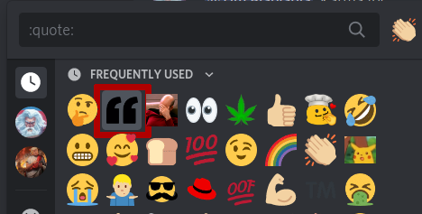
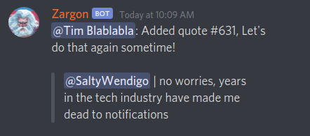

Members have access to our Discord server. What do you need to know
about Discord? Not much really! Most important though, keep in mind
that our [Code of Conduct](index.html#code-of-conduct) extends to
Discord as well as in-person events. Here are some other topics of
interest.

# [Joining](#joining)

After you have been accepted into our community a member will send you
an invite on Discord. Initially you will be in a virtual purgatory,
limited to our `#welcome` channel. Shortly thereafter a member will
grant you the `zargonauts` role. This will grant you full server
access and all topics and sub-topics will become available.

# [New Channels](#new-channels)

Our community members are interested in all sorts of weird stuff. But
not ever hobby receives its own topic or sub-topic. Below are the
criteria we consider when evaluating whether or not a new
topic/sub-topic should be created.

- Are several people interested in this topic?
- Have a few people **expressed interest** in having a specific dedicated topic?
- Is conversation about the topic overwhelming an existing channel?
- Is this a niche topic?
- Is this this topic temporal?

Here are some examples of how specific topics/sub-topics got created
in the past:

**Time limited (temporal) topics**: We have the `#zargcon` channel
  which is primarily used in the weeks/months leading up to our annual
  in-person gaming event. `#sekret-zaron` is similar, there we
  coordinate for our annual sekret zargon gift exchange.

**Sub-Topics**: Although `#miniatures` could fit into `#games` and
  `#maker` there was sufficient activity and participation to receive
  its own dedicated sub-topic. Similar story for `#minecraft`, there
  was enough conversation and participation in `#games` that it was
  dominating the channel and was given its own dedicated one to keep
  `#games` sane.


OK! You've read all this background and understand what the
considerations are and you think it's time to have a new
topic/sub-topic added. Next you should see if a few people are also
intersted. Then, if there is interest and agreement, tag the `@admin`
group to look at the request (if they haven't noticed already).

# [Zargon (our bot)](#zargon)

## [Getting Started](#zargon-getting-started)

Zargon is our friendly resident bot. He responds to messages prefixed
with a `!`. For example:

> `!help`

If you `!help` in a channel Zargon will respond to you in a direct
message with list of commands and basic descriptions. If you want
additional help with something specific you can run that command with
`help` added to the end. Let's say you wanted to know what `!random`
is all about:

> `!random help`

You will get another direct message explaining not just the `random`
command, but also all of the other commands from that plugin (`random`
is part of the `quote` plugin). Examples are included!

## [Quotes](#zargon-quotes)

Our community has a rich history of saying hilarious and otherwise
poignant (or deeply disturbing) things. We like to memorialize those
memories and the people who said them by capturing them in our quote
database.


There are two ways to capture a memory. You can add it to the quote
database directly using the `!quote add` command, or you can use the
reaction shortcut. Here's a direct entry:

> `!quote add @SaltyWendigo: no worries, years in the tech industry have made me dead to notifications`

_Important note here: If you want to fully attribute a quote to someone you should type the @ symbol, begin typing their handle, and tab complete the rest_

Zargon will respond telling you the quote has been added to the db and
give you the ID number if you change your mind and want to remove it.

**But there is a quicker way!** Add the `double-quote` reaction to the
message you want to save in the database.



Zargon will notice the new reaction and add the full message to the
database:



**But how do you see quotes!?** Use the `!random` command and Zargon
  will spit out a quote at random. Use `!quote help` to see a list of
  other quote related commands.

## [The Art of Figlet](#zargon-figlet)

The Art of Figlet is taking text input and generating ASCII banners
suitable for display on monospaced consoles. Zargon has a plugin for
generating figlet banners. He will render your input with a randomly
selected figlet(*). If this still doesn't make sense to you, here is
an example:

```
!figlet Star Wars

     _______.___________.    ___      .______      
    /       |           |   /   \     |   _  \     
   |   (----`---|  |----`  /  ^  \    |  |_)  |    
    \   \       |  |      /  /_\  \   |      /     
.----)   |      |  |     /  _____  \  |  |\  \----.
|_______/       |__|    /__/     \__\ | _| `._____|
                                                   
____    __    ____  ___      .______          _______.
\   \  /  \  /   / /   \     |   _  \        /       |
 \   \/    \/   / /  ^  \    |  |_)  |      |   (----`
  \            / /  /_\  \   |      /        \   \    
   \    /\    / /  _____  \  |  |\  \----.----)   |   
    \__/  \__/ /__/     \__\ | _| `._____|_______/    
```

Due to the amount of screen space required for figlets, they are
restricted to the `#shitposting` and `#bot-spam` topics.

_* With one exception: Due to "historical reasons" the text 'Star Wars' is always rendered in the Star Wars font_
